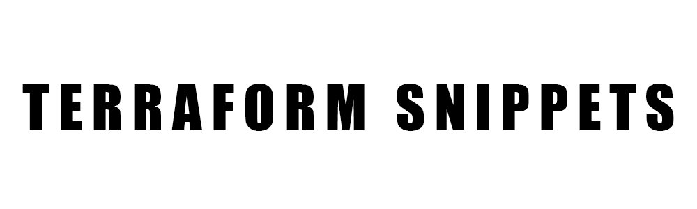

  

 
 
Terraform Snippets is an a collection of HCL scripts.

I wanted to experiment with Terraform and trying the multiple options that it could offer.

**This is why I created this project**.

[Snippet List](#snippit-list) •
[Technologies Used](#technologies-used) •
[Contact Me](#contact-me) 

## Snippet List

1. 

## Technologies Used

| Application                                         | Description                                  
| --------------------------------------------------- |--------------------------------------------- 
| [Terraform](https://www.terraform.io/)                           | An open-source, infrastructure as code, software tool created by HashiCorp 
| [AWS](https://aws.amazon.com/)                | An on-demand cloud computing platforms and APIs to individuals, companies, and governments, on a metered pay-as-you-go basis  
| [Markdown Guide](https://www.markdownguide.org/)    | A reference guide that explains how to use markdown                                 

## Contact Me

