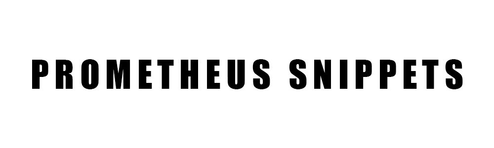

  

 
 
Prometheus Snippets is a collection of Prometheus and PromQL Scripts.

I wanted to experiment with Prometheus trying the multiple options that they could offer.

**This is why I created this project**.

[Snippet List](#snippit-list) •
[Technologies Used](#technologies-used) •
[Contact Me](#contact-me) 

## Snippet List

1.

## Technologies Used

| Application                                         | Description                                  
| --------------------------------------------------- |--------------------------------------------- 
| [Prometheus](https://prometheus.io/)                           | An open-source monitoring system with a dimensional data model, flexible query language, efficient time series database and modern alerting approach.
| [PromQL](https://prometheus.io/docs/prometheus/latest/querying/basics/)                           | A functional query language that lets the user select and aggregate time series data in real time.               

## Contact Me

