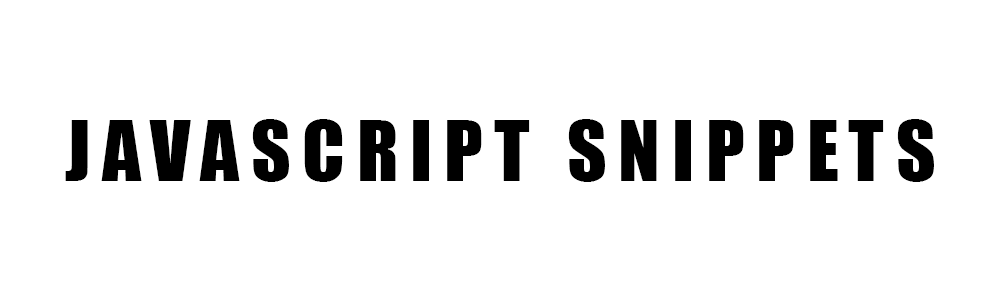

  

 
 
Javascript Snippets is an a collection of JS scripts.

I wanted to experiment with Javascripts and trying the multiple options that it could offer.

**This is why I created this project**.

[Snippet List](#snippit-list) •
[Technologies Used](#technologies-used) •
[Contact Me](#contact-me) 

## Snippet List

## Technologies Used

| Application                                         | Description                                  
| --------------------------------------------------- |--------------------------------------------- 
| [Javascript](https://www.terraform.io/)                           | A programming language that is one of the core technologies of the World Wide Web.      
| [Markdown Guide](https://www.markdownguide.org/)    | A reference guide that explains how to use markdown                                 

## Contact Me

