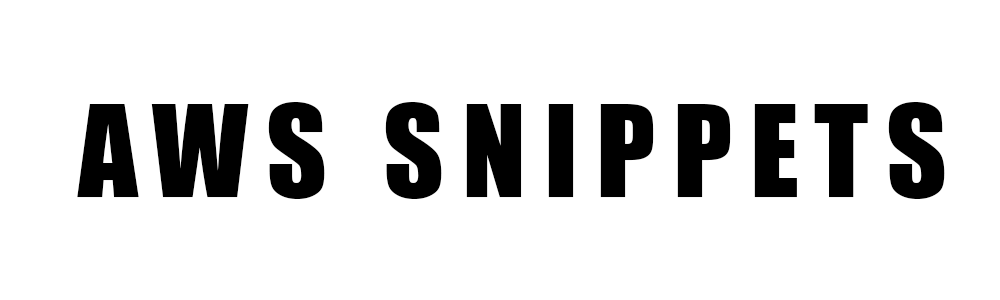

  

 
 
AWS Snippets is an a collection of AWS and Cloud Formation Snippets.

I wanted to experiment with AWS, trying the multiple services that it could offer.

**This is why I created this project**.

[Snippet List](#snippit-list) •
[Technologies Used](#technologies-used) •
[Contact Me](#contact-me) 

## Snippet List

1.

## Technologies Used

| Application                                         | Description                                  
| --------------------------------------------------- |--------------------------------------------- 
| [AWS](https://aws.amazon.com/)                           | A subsidiary of Amazon that provides on-demand cloud computing platforms and APIs to individuals, companies, and governments, on a metered pay-as-you-go basis.
| [AWS Cloud Formation](https://aws.amazon.com/cloudformation/)                           | An infrastructure as code (IaC) service that allows you to easily model, provision, and manage AWS and third-party resources.

## Contact Me

