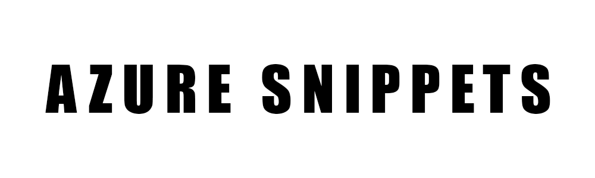

  

 
 
Azure Snippets is an a collection of Azure and ARM Templates Snippets.

I wanted to experiment with Azure, trying the multiple options that they could offer.

**This is why I created this project**.

[Snippet List](#snippit-list) •
[Technologies Used](#technologies-used) •
[Contact Me](#contact-me) 

## Snippet List

1.

## Technologies Used

| Application                                         | Description                                  
| --------------------------------------------------- |--------------------------------------------- 
| [Azure](https://azure.microsoft.com/en-us/)                           | A cloud computing platform operated by Microsoft for application management via around the world-distributed data centers
| [ARM Templates](https://learn.microsoft.com/en-us/azure/azure-resource-manager/templates/overview)                           | An infrastructure as code, a concept where you define the infrastructure that needs to be deployed             
                          

## Contact Me

